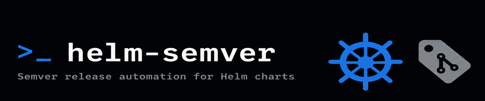

<div align="center">



<h1><strong>Welcome to helm-semver</strong></h1>

<p>Semver release automation for Helm chart monorepos, single Helm charts and everything in-between.<br>
helm-semver bumps chart versions from conventional commits, packages and pushes to any OCI registry.<br>
Works as a GitHub Action or standalone Docker image on any CI platform.</p>

<br>

[](https://codecov.io/gh/rhysmcneill/helm-semver)
[](https://golang.org)
[](https://github.com/rhysmcneill/helm-semver/releases)
[](LICENSE)
[](https://github.com/rhysmcneill/helm-semver)
[](https://github.com/rhysmcneill/helm-semver/forks)

<br>


<br>


</div>

---

## The problem

Releasing a Helm chart from a monorepo today looks like this:

```bash
# Manually bump version in Chart.yaml
# Parse git log with grep to figure out if it's a patch, minor, or major bump
# helm package charts/observability
# helm push observability-0.2.0.tgz oci://ghcr.io/my-org/helm-charts
# git tag observability-v0.2.0 && git push --tags
# ...repeat for every chart that changed
```

With `helm-semver`:

```bash
helm-semver release \
  --registry oci://ghcr.io/my-org/helm-charts \
  --registry-type oci
```

Every chart that has `fix:`, `feat:`, or `feat!:` commits since its last release is bumped, packaged, pushed, committed, and tagged automatically.

---

## Install

```bash
# Linux / macOS — download the binary directly
curl -L https://github.com/rhysmcneill/helm-semver/releases/latest/download/helm-semver-linux-amd64 \
  -o /usr/local/bin/helm-semver && chmod +x /usr/local/bin/helm-semver

# Go install
go install github.com/rhysmcneill/helm-semver/cmd/helm-semver@latest

# Docker
docker run --rm -v $(pwd):/workspace ghcr.io/rhysmcneill/helm-semver:latest \
  release --registry oci://ghcr.io/my-org/helm-charts
```

**GitHub Action:**

```yaml
- uses: rhysmcneill/helm-semver@v1
  with:
    registry: oci://ghcr.io/${{ github.repository_owner }}/helm-charts
    github-token: ${{ secrets.GITHUB_TOKEN }}
```

> Binaries for Linux, macOS, and Windows on every [release](https://github.com/rhysmcneill/helm-semver/releases).

---

## Real-world use cases

### Monorepo: multiple charts released independently from one push

The primary use case. A single push touches two charts with different commit types — each gets its own independent version bump and OCI tag.

```
charts/
├── observability/   feat: add tempo datasource    → 0.1.0 → 0.2.0 (minor)
└── my-service/      fix: correct health check path → 1.3.0 → 1.3.1 (patch)
```

```yaml
# .github/workflows/release.yml
- uses: rhysmcneill/helm-semver@v1
  with:
    registry: oci://ghcr.io/${{ github.repository_owner }}/helm-charts
    changelog: "true"
    github-release: "true"
    github-token: ${{ secrets.GITHUB_TOKEN }}
```

Each chart is tagged independently (`observability-v0.2.0`, `my-service-v1.3.1`) and pushed as separate OCI artifacts. No chart list to maintain — new directories are detected automatically.

### Single chart repo

```yaml
- uses: rhysmcneill/helm-semver@v1
  with:
    charts-dir: .        # Chart.yaml is at the repo root
    registry: oci://ghcr.io/my-org/helm-charts
```

### GitLab CI

```yaml
release-charts:
  image: ghcr.io/rhysmcneill/helm-semver:latest
  script:
    - helm-semver release
        --registry oci://registry.gitlab.com/my-group/helm-charts
        --registry-username $CI_REGISTRY_USER
        --registry-password $CI_REGISTRY_PASSWORD
  only:
    - main
```

### Bitbucket Pipelines

Using ECR as the OCI registry — the natural fit for Bitbucket-based pipelines
in AWS environments. See [docs/ecr.md](docs/ecr.md) for full OIDC role setup.

```yaml
pipelines:
  branches:
    main:
      - step:
          name: Release Charts
          oidc: true
          image: ghcr.io/rhysmcneill/helm-semver:latest
          script:
            - pipe: atlassian/aws-assume-role-with-web-identity:1.0.0
              variables:
                AWS_REGION: eu-west-1
                ROLE_ARN: $AWS_ROLE_ARN
            - export ECR_TOKEN=$(aws ecr get-login-password --region eu-west-1)
            - helm-semver release
                --registry oci://123456789012.dkr.ecr.eu-west-1.amazonaws.com/helm-charts
                --registry-username AWS
                --registry-password "$ECR_TOKEN"
```

### Dry-run as a PR gate

Add `helm-semver release --dry-run` as a required CI check on every pull
request. Reviewers see exactly which charts will be released and at what
version before anything merges — no surprises on main.

```yaml
# .github/workflows/release-preview.yml
name: Release Preview

on:
  pull_request:
    branches: [main]
    paths:
      - "charts/**"

jobs:
  preview:
    runs-on: ubuntu-latest
    permissions:
      contents: read
      pull-requests: write

    steps:
      - uses: actions/checkout@v4
        with:
          fetch-depth: 0

      - name: Preview releases (dry-run)
        id: preview
        run: |
          OUTPUT=$(helm-semver release \
            --registry oci://ghcr.io/${{ github.repository_owner }}/helm-charts \
            --dry-run \
            --changelog=false 2>&1)
          echo "$OUTPUT"
          echo "output<<EOF" >> $GITHUB_OUTPUT
          echo "$OUTPUT" >> $GITHUB_OUTPUT
          echo "EOF" >> $GITHUB_OUTPUT
        # Use the Docker image directly so no binary install is needed
        env:
          DOCKER_IMAGE: ghcr.io/rhysmcneill/helm-semver:latest

      - name: Post preview comment
        uses: actions/github-script@v7
        with:
          script: |
            const output = `${{ steps.preview.outputs.output }}`;
            github.rest.issues.createComment({
              issue_number: context.issue.number,
              owner: context.repo.owner,
              repo: context.repo.repo,
              body: `### Release preview\n\`\`\`\n${output}\n\`\`\``
            });
```

The PR will show a comment like:

```
Release preview
  observability: 0.1.0 → 0.2.0 (minor)
    [dry-run] would push to oci://ghcr.io/my-org/helm-charts
    [dry-run] would tag observability-v0.2.0
    [dry-run] would update CHANGELOG.md
  my-service: no releasable commits — skipping
```

---

## Why not just use semantic-release?

<div align="center">

| | Shell script | semantic-release | chart-releaser | **helm-semver** |
|---|---|---|---|---|
| Conventional commit parsing | Manual grep | ✓ | ✗ | ✓ |
| Helm monorepo (independent versions) | Race condition | ✗ | ✗ | ✓ |
| OCI registry push | DIY | ✗ | ✗ | ✓ |
| ChartMuseum / Harbor | DIY | ✗ | ✗ | ✓ |
| GitHub Pages | DIY | ✗ | ✓ | ✓ |
| Changelog generation | DIY | ✓ | ✗ | ✓ |
| GitHub Releases | DIY | ✓ | ✓ | ✓ |
| Dry-run mode | Not practical | ✗ | ✗ | ✓ |
| Works on GitLab / Bitbucket | Copy the script | Node.js required | ✗ | Docker image |
| Tested | Almost never | ✓ | ✓ | ✓ |

</div>

`semantic-release` is excellent for application code but requires Node.js and is not monorepo-aware for Helm charts. `chart-releaser` only publishes to GitHub Pages. `helm-semver` solves exactly this gap: conventional commits → semver → OCI, on any CI, for any number of charts.

---

## Commands

### `helm-semver release`

```
Flags:
  --charts-dir string           Root directory containing chart subdirectories (default "charts")
  --registry string             Registry URL (required)
  --registry-type string        Registry type: oci, chartmuseum, github-pages (default "oci")
  --registry-username string    Registry username
  --registry-password string    Registry password (env: REGISTRY_PASSWORD)
  --git-push                    Push version bump commit and tags (default true)
  --dry-run                     Print what would happen without making any changes
  --changelog                   Append release entry to CHANGELOG.md per chart (default true)
  --github-release              Create a GitHub Release for each chart
  --github-token string         GitHub token (env: GITHUB_TOKEN)
  --github-owner string         GitHub repository owner (env: GITHUB_REPOSITORY_OWNER)
  --github-repo string          GitHub repository name
  --tag-prefix string           Prefix for git tags
  --git-author-name string      Git commit author name (default "helm-semver[bot]")
  --git-author-email string     Git commit author email
```

### `helm-semver version`

```bash
helm-semver version
# helm-semver v0.1.0 (commit: abc1234, built: 2026-06-13T12:00:00Z)
```

---

## Conventional commits

| Commit prefix | Bump | Example |
|---|---|---|
| `fix:` / `fix(scope):` | patch | `fix: correct loki retention default` |
| `feat:` / `feat(scope):` | minor | `feat: add tempo datasource` |
| `feat!:` / `BREAKING CHANGE` | major | `feat!: remove --registry-url flag` |

The most significant bump across all commits since the last release tag wins. Commits not matching any prefix produce no release for that chart. Scoped commits (`feat(observability):`) are counted toward all charts unless you rely on the path-based change detection.

---

## Registry backends

### OCI (GHCR, ECR, ACR, Docker Hub, Artifactory)

```bash
helm-semver release \
  --registry oci://ghcr.io/my-org/helm-charts \
  --registry-type oci \
  --registry-username $GITHUB_ACTOR \
  --registry-password $GITHUB_TOKEN
```

> [!NOTE]
> **Using Amazon ECR?** ECR requires a short-lived token obtained via
> `aws ecr get-login-password` rather than static credentials, and IAM roles
> are the recommended authentication method. See [docs/ecr.md](docs/ecr.md)
> for full setup instructions covering GitHub Actions OIDC, GitLab CI,
> Bitbucket Pipelines, and EKS pod identity.
>
> **Using Azure ACR?** ACR uses a similar short-lived token pattern via
> `az acr login --expose-token`. See [docs/acr.md](docs/acr.md) for workload
> identity (OIDC), service principal, and AKS pod identity setup.

### ChartMuseum / Harbor

```bash
helm-semver release \
  --registry https://charts.my-org.com \
  --registry-type chartmuseum \
  --registry-username admin \
  --registry-password $CM_PASSWORD
```

### GitHub Pages

```bash
helm-semver release \
  --registry https://my-org.github.io/helm-charts \
  --registry-type github-pages \
  --github-token $GITHUB_TOKEN
```

---

## Documentation

| | |
|--|--|
| [ECR / IAM role auth](docs/ecr.md) | GitHub Actions OIDC, GitLab, Bitbucket, EKS pod identity |
| [ACR / workload identity](docs/acr.md) | GitHub Actions OIDC, service principal, AKS pod identity |
| [Contributing](CONTRIBUTING.md) | How to build, test, and submit changes |
| [Changelog](CHANGELOG.md) | Release history |
| [Releases](https://github.com/rhysmcneill/helm-semver/releases) | Binary downloads |

---

## Contributors

Thank you to everyone who has contributed to helm-semver!

[](https://github.com/rhysmcneill/helm-semver/graphs/contributors)

Contributions are welcome — see [CONTRIBUTING.md](CONTRIBUTING.md) to get started.

---

<div align="center">
MIT License &nbsp;·&nbsp; <a href="https://github.com/rhysmcneill/helm-semver/issues">Report a bug</a> &nbsp;·&nbsp; <a href="https://github.com/rhysmcneill/helm-semver/issues">Request a feature</a>
</div>
